<div align="center">

[](https://github.com/klasolsson81)

<br/>

[](https://klasolsson.se)
[](https://linkedin.com/in/klasolsson81)
[](mailto:klasolsson81@gmail.com)
[](https://github.com/klasolsson81)

</div>

<br/>

## &nbsp;About Me

```yaml
name: Klas Olsson
location: Göteborg, Sweden
role: Full-Stack Developer & .NET Student

background: >
  Career changer. Spent 22 years in Swedish automotive manufacturing
  before pivoting to software development in autumn 2025. Now shipping
  real SaaS products while studying full-time — from database design
  and secure .NET APIs to polished React frontends and cloud deployment.

education:
  program: Systemutvecklare .NET
  school: NBI-Handelsakademin, Göteborg
  graduation: 2027

currently_working_on:
  - DOJO Future LMS — Team member, Infinet Code (Swedish YH/MYH platform)
  - JobbPilot — AI-powered job application tracker (SaaS, solo build)

currently_learning:
  - Clean Architecture & CQRS with MediatR
  - Pipeline Behaviors & FluentValidation
  - ADO.NET and stored procedures
  - AWS infrastructure (first production deployment)
  - Agentic multi-instance Claude Code workflows

focus_areas:
  - .NET 8 + Clean Architecture (the stack I'm going deep on)
  - Full-stack TypeScript with Next.js & React
  - AI integration (OpenAI, Claude, Gemini)
  - Security: JWT, RBAC, 2FA, encryption
  - Cloud: Azure, AWS, Vercel, Supabase

fun_fact: >
  Built KalasKoll for my son Alexander's 6th birthday party —
  ended up hitting 60,000+ views on LinkedIn.
```

<br/>

## &nbsp;Tech Stack

<div align="center">

### Backend & .NET


### Frontend & React


### Database & Cloud


### DevOps & Tools


### AI & Payments


</div>

<br/>

## &nbsp;Featured Projects

<div align="center">

<table>
<tr>
<td width="50%" valign="top">

### DOJO Future LMS &nbsp;
<br/>
<p><strong>Learning Management System for Swedish Yrkeshögskola</strong></p>
<p>Team member at Infinet Code, building a purpose-built LMS for Swedish YH education — MYH-compliance reporting, LIA-management for internship partners, CSN attendance integration, and BankID auth. Four portals: SuperAdmin, Teacher, Student, and Company.</p>
<p>


</p>
</td>
<td width="50%" valign="top">

### JobbPilot &nbsp;
<br/>
<p><strong>AI-powered job application tracker (SaaS)</strong></p>
<p>Complete job-search companion: kanban pipeline for applications, automated relevance scoring, Platsbanken scraping via n8n with Discord webhooks, and a civic-design UI inspired by Swedish government services. My current Clean Architecture & AWS playground.</p>
<p>


</p>
</td>
</tr>
<tr>
<td width="50%" valign="top">

### <a href="https://kalaskoll.se">KalasKoll.se</a> &nbsp;
<br/>
<p><strong>Swedish SaaS for kids' birthday party invitations</strong></p>
<p>Full RSVP management with GDPR-encrypted allergy tracking, AI-generated cards, QR-code invitations, Stripe payments, and 87 indexed pages with full SEO. Built end-to-end solo.</p>
<p><strong>60,000+ views on LinkedIn at launch</strong></p>
<p>


</p>
</td>
<td width="50%" valign="top">

### Yobber V2 &nbsp;
<br/>
<p><strong>AI-driven recruitment platform rebuild</strong></p>
<p>Complete rebuild for Devotion Ventures: AI candidate-job matching, kanban pipeline, RBAC, live video interviews via Daily.co, and i18n (Swedish/English). Shipped <strong>96/100 backlog items in ~3 weeks</strong> solo using agentic Claude Code workflows. 112 tests green at handover.</p>
<p>


</p>
</td>
</tr>
</table>

</div>

<br/>

## &nbsp;GitHub Metrics

<div align="center">
  
</div>

<br/>

<div align="center">

[](https://github.com/klasolsson81)

</div>

<br/>

## &nbsp;Contribution Snake

<picture>
  <source media="(prefers-color-scheme: dark)" srcset="https://raw.githubusercontent.com/klasolsson81/klasolsson81/output/github-contribution-grid-snake-dark.svg" />
  <source media="(prefers-color-scheme: light)" srcset="https://raw.githubusercontent.com/klasolsson81/klasolsson81/output/github-contribution-grid-snake.svg" />
  
</picture>

<br/><br/>

<div align="center">

### Let's connect! I'm always open to interesting projects and collaborations.

<br/>

[](https://klasolsson.se)
[](https://linkedin.com/in/klasolsson81)
[](https://github.com/klasolsson81)

</div>


